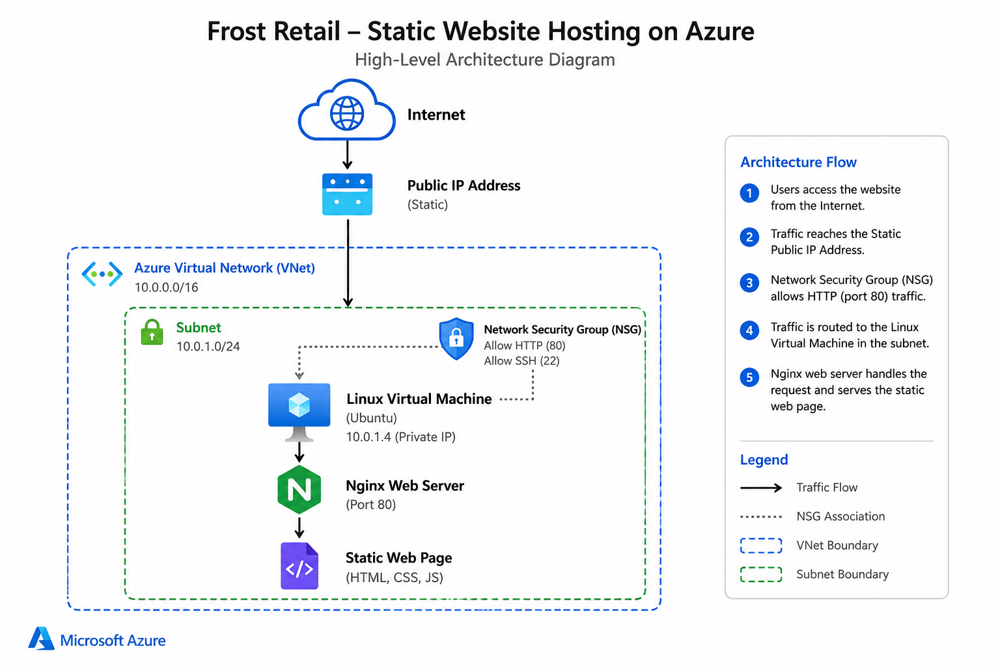

# Azure Enterprise Infrastructure

## Project Overview

This repository contains the design, implementation, and documentation of a production-ready Azure enterprise infrastructure for **Frost Retail**, a fictional retail company.

The project demonstrates how Azure services can be used to build a secure, scalable, highly available, and well-governed cloud environment using Microsoft Azure best practices.

## Architecture Diagram

The diagram below shows the high-level architecture of the Azure infrastructure for Frost Retail.

> **Project Status:** In Progress